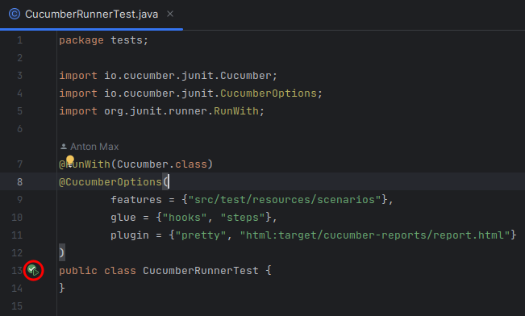
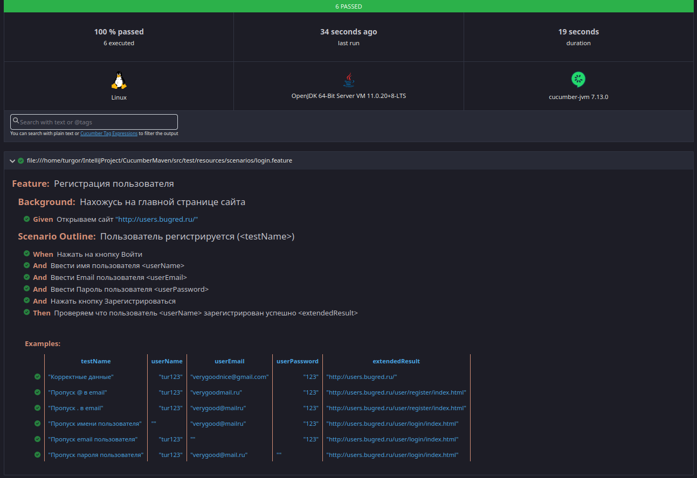

# CucumberMaven

## Описание

Цель проекта: получение навыков в написание авто тестов на Java
на примере веб-сайта (<a href="http://users.bugred.ru/">users</a>).

## Технологии

- Java
- JUnit
- Selenid
- Cucumber(BDD)
- Cucumber report

## Окружение

Для запуска тестов нужно установить <a href="https://www.google.com/intl/ru_ru/chrome/">Google Chrome</a>

## Запуск тестов

## Cucumber report

